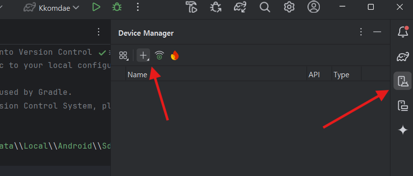

# 포팅

# 1. 개요

본 문서는 프로젝트를 다른 개발 환경에 포팅하거나 운영 서버에 배포하기 위한 환경설정, 의존성 버전 및 설치 방법을 안내합니다.

- 주요 개발 OS: Window 11, (EC2) Ubuntu 22.04.5 LTS
- CI/CD 환경: Jenkins LTS 최신버전

# 2. 선행 요구사항 (Prerequisites)

1. **Java 17**
    - OpenJDK 17 권장
    - `JAVA_HOME` 환경변수 설정 필요 (링크 참고 >  [[Java] 환경 변수 설정하기](https://velog.io/@bi-sz/Java-%ED%99%98%EA%B2%BD-%EB%B3%80%EC%88%98-%EC%84%A4%EC%A0%95%ED%95%98%EA%B8%B0))
2. **Gradle 8.12.1 이상**
    - Spring Boot 빌드에 사용
3. **Node.js 22.14 이상**
    - React(landing) 프로젝트 빌드/실행에 사용
4. **Python 3.11 권장**
    - Flask(AI 분석), Django(landing & diagnostics) 서버 동작
    - `pip` 최신 버전 사용 권장
5. **Android Studio 최신**
    - Kotlin 1.9.x, AGP 8.5.x
    - minSdk 24, targetSdk 34, compileSdk 35

# 3. 폴더 구조 및 설치, local 환경에서 실행

```
S12P21D101/
 ┣ ai/                 # ai 
 ┣ backend/            
 **|**  ┣ kkomdae          # Spring Boot  
 **|**	┣ kkomdae_django   # Django
 **|**  ┗ ****kkomdae_flask    **#** FastAPI
 ┣ frontend/ 
 **|**  ┣ kkomdae          # Android
 **|**  ┗ ****kkomdae_landing  # landing
 ┣ laptop_test         # 자가진단 프로그램
 ┗ ...
```

## 3.1. 레포지토리 클론 및 이동

```bash
git clone https://lab.ssafy.com/s12-ai-image-sub1/S12P21D101.git
cd S12P21D101
```

## 3.2. 환경 변수 설정(.env)

### 3.2.1. Spring Boot (위치 : backend/kkomdae/src/main/resources/.env)

```

# DB 관련
DB_URL=
DB_USERNAME=
DB_PW=8
DDL_AUTO=

# 싸피 로그인 관련
REDIRECT_URI=
CLIENT_ID=
CLIENT_SECRET=
API_KEY=

JWT_SECRET=

# MM 관련
MATTERMOST_BASE_URL=
MATTERMOST_TEAM_ID=
MATTERMOST_CHANNEL_ID=

# S3 접근 관련
S3_ACCESSKEY=
S3_SECRETKEY=
S3_BUCKETNAME=
S3_PREFIX=

# GPT 관련
OPENAI_KEY=
```

### 3.2.2. fastAPI(위치 : backend/kkomdae_flask/.env)

```
AWS_ACCESS_KEY_ID=
AWS_SECRET_ACCESS_KEY=
AWS_REGION=
BUCKET_NAME=
S3_PREFIX=

OPENAI_KEY=
```

### 3.2.3. django (위치 : backend/kkomdae_django/.env)

```
AWS_ACCESS_KEY_ID=
AWS_SECRET_ACCESS_KEY=
AWS_REGION=
BUCKET_NAME=
S3_PREFIX=
```

### 3.2.4. android studio (위치: frontend/Kkomdae/Gradle Scripts/local.properties)

```jsx
## This file must *NOT* be checked into Version Control Systems,
# as it contains information specific to your local configuration.
#
# Location of the SDK. This is only used by Gradle.
# For customization when using a Version Control System, please read the
# header note.
#Fri Apr 04 17:34:42 KST 2025
sdk.dir=
SERVER_URL=
VISION_API_KEY=
```

## 3.3. 로컬 의존성 설치 및 실행

### **3.3.1. Frontend(React)**

```bash
cd frontend/kkmodae_landing
npm install
npm run dev
```

- Node.js 22.14
- React 19.0.0 기반
- Typescript 5.7.2
- Axios ^1.8.4
1. **Android**
    - Android Studio에서 `frontend/Kkomdae` 디렉토리를 열기
    - `libs.versions.toml`, `build.gradle.kts` 자동 동기화(Gradle Sync)
    - Kotlin 1.9.23, AGP 8.5.1, minSdk 24, targetSdk 34, compileSdk 35
    - Hilt, Retrofit, CameraX, ML Kit 등 의존성은 `build.gradle.kts` 참조
    
    ---
    
    
    
    
    
    
    
    
    

### **3.3.2. Backend(Spring Boot)**

```bash
cd backend/Kkomdae
./gradlew clean build
# local 프로필로 실행
java -jar build/libs/kkomdae-0.0.1-SNAPSHOT.jar --spring.profiles.active=local 

```

- Java 17, Gradle 8.12.1
- Spring Boot 3.4.3, Hibernate 6.6.8.Final
- Lombok, QueryDSL, iTextPDF 등 포함

### 3.3.3. Flaks (ai 분석 서버)

```bash
cd backend/kkomdae_flask
python -m venv venv # 가상환경 설치
source venv/Scripts/activate # 가상환경 실행
pip install -r requirements.txt # 의존성 설치
python app.py # 서버 실행
```

- Python 3.11 권장

### **3.3.4. Django(landing & diagnostics)**

```bash
cd backend/kkomdae_django # backend폴더 내 Django
python -m venv venv # 가상환경 설치
source venv/Scripts/activate # 가상환경 실행
pip install -r requirements.txt # 의존성 설치
python manage.py runserver # 서버 실행
```

- Django 5.1.7, python-dotenv, boto3, gunicorn 등
- Python 3.11 권장

---

# 4. EC2 세팅 및 설정

- ec2 인스턴스 구성 및 접속을 수행했다는 가정에서 메뉴얼을 작성한다.

## 4.1. Docker

### 4.1.1. Docker 설치

```bash
# 도커 설치
sudo apt-get update
sudo apt install apt-transport-https ca-certificates curl software-properties-common -y
sudo install -m 0755 -d /etc/apt/keyrings
sudo curl -fsSL https://download.docker.com/linux/ubuntu/gpg -o /etc/apt/keyrings/docker.asc
sudo chmod a+r /etc/apt/keyrings/docker.asc
echo \
  "deb [arch=$(dpkg --print-architecture) signed-by=/etc/apt/keyrings/docker.asc] https://download.docker.com/linux/ubuntu \
  $(. /etc/os-release && echo "${UBUNTU_CODENAME:-$VERSION_CODENAME}") stable" | \
  sudo tee /etc/apt/sources.list.d/docker.list > /dev/null
sudo apt-get update

sudo apt-get install docker-ce docker-ce-cli containerd.io docker-buildx-plugin docker-compose-plugin
#Docker version 28.0.1, build 068a01e
#젠킨스 컨테이너 도커 소켓 연결을 위한 권한 설정
sudo usermod -aG docker $USER
newgrp docker
```

### 4.1.2 Docker-compose.yml 세팅

파일 위치: /home/ubuntu/d-101/docker-compose.yml

```jsx
services:
  backend:
    image: dororo737/d-101:latest
    container_name: backend
    restart: unless-stopped
    ports:
      - "127.0.0.1:8080:8080"
    environment:
      SPRING_PROFILES_ACTIVE: prod
      TZ: Asia/Seoul
    networks:
      - app-network
    depends_on:
      postgres:
        condition: service_healthy

  postgres:
    image: postgres:latest
    container_name: postgres
    restart: unless-stopped
    ports:
      - 54321:5432
    environment:
      POSTGRES_USER: postgres
      POSTGRES_PASSWORD: 1
      POSTGRES_DB: postgres
      TZ: Asia/Seoul
    volumes:
      - postgres_data:/var/lib/postgresql/data
    networks:
      - app-network
    healthcheck:
      test: ["CMD-SHELL", "pg_isready -U postgres -d postgres"]
      interval: 5s
      timeout: 3s
      retries: 5

  frontend:
    image: dororo737/d-101-front:latest
    container_name: frontend
    networks:
      - app-network
    restart: unless-stopped
    ports:
      - "127.0.0.1:8081:80"
    environment:
      TZ: Asia/Seoul

  django:
    image: dororo737/d-101-django:latest
    container_name: django
    networks:
      - app-network
    restart: unless-stopped
    ports:
      - "127.0.0.1:8000:8000"
    environment:
      TZ: Asia/Seoul

  flask:
    image: dororo737/d-101-flask:latest
    container_name: flask
    networks:
      - app-network
    restart: unless-stopped
    environment:
      TZ: Asia/Seoul

networks:
  app-network:
    driver: bridge

volumes:
  postgres_data:

```

## 4.2. PostgreSQL(Docker container) 설치

docker-compose.yml 실행 시 설치

`docker compose up -d`

## 4.3. Nginx

### 4.3.1. Nginx설치

```jsx
sudo apt update

# nginx 설치
sudo apt install nginx

# 상태 확인
sudo systemctl status nginx

# Certbot snap 설치하기
sudo snap install --classic certbot

# Certbot 명령어 쉽게 사용하기 위해 경로 설정
sudo ln -s /snap/bin/certbot /usr/bin/certbot

# HTTPS 인증서 발급받고 Nginx 자동 설정
sudo certbot --nginx

# 접속 시 웰컴 페이지와 주소창 왼쪽에 자물쇠가 보인다 (보안연결) 
https://...
```

### 4.3.2. Nginx 설정 (default 파일)

위치: `/etc/nginx/sites-available/default`

```jsx
server {
    listen 80;
    listen [::]:80;
    server_name j12d101.p.ssafy.io;

    # HTTP를 HTTPS로 리다이렉트
    return 301 https://$host$request_uri;
}

server {
    listen 443 ssl;
    listen [::]:443 ssl;
    server_name j12d101.p.ssafy.io;

    ssl_certificate /etc/letsencrypt/live/p.ssafy.io/fullchain.pem;
    ssl_certificate_key /etc/letsencrypt/live/p.ssafy.io/privkey.pem;

    include /etc/letsencrypt/options-ssl-nginx.conf;
    ssl_dhparam /etc/letsencrypt/ssl-dhparams.pem;

    root /var/www/html;
    index index.html index.htm index.nginx-debian.html;

    # Frontend 프록시 (기본 경로)
    location / {
        proxy_pass http://localhost:8081;
        proxy_http_version 1.1;
        proxy_set_header Upgrade $http_upgrade;
        proxy_set_header Connection 'upgrade';
        proxy_set_header Host $host;
        proxy_cache_bypass $http_upgrade;
        proxy_set_header X-Real-IP $remote_addr;
        proxy_set_header X-Forwarded-For $proxy_add_x_forwarded_for;
        proxy_set_header X-Forwarded-Proto $scheme;
        proxy_set_header X-Forwarded-Host $host;
        proxy_set_header X-Forwarded-Port $server_port;
    }

    # Backend 프록시
    location /api/ {
        proxy_pass http://localhost:8080;
        proxy_http_version 1.1;
        proxy_set_header Upgrade $http_upgrade;
        proxy_set_header Connection 'upgrade';
        proxy_set_header Host $host;
        proxy_cache_bypass $http_upgrade;
        proxy_set_header X-Real-IP $remote_addr;
        proxy_set_header X-Forwarded-For $proxy_add_x_forwarded_for;
        proxy_set_header X-Forwarded-Proto $scheme;
        proxy_set_header X-Forwarded-Host $host;
        proxy_set_header X-Forwarded-Port $server_port;
    }

    # Backend image 프록시
    location /image/ {
        proxy_pass http://localhost:8080;
        proxy_http_version 1.1;
        proxy_set_header Upgrade $http_upgrade;
        proxy_set_header Connection 'upgrade';
        proxy_set_header Host $host;
        proxy_cache_bypass $http_upgrade;
        proxy_set_header X-Real-IP $remote_addr;
        proxy_set_header X-Forwarded-For $proxy_add_x_forwarded_for;
        proxy_set_header X-Forwarded-Proto $scheme;
        proxy_set_header X-Forwarded-Host $host;
        proxy_set_header X-Forwarded-Port $server_port;
    }

    # Jenkins 프록시
    location /jenkins/ {
        proxy_pass http://localhost:18080;
        proxy_http_version 1.1;

        #업그레이드 및 헤더 설정
        proxy_set_header Upgrade $http_upgrade;
        proxy_set_header Connection 'upgrade';
        proxy_set_header Host $host;
        proxy_cache_bypass $http_upgrade;
        proxy_set_header X-Real-IP $remote_addr;
        proxy_set_header X-Forwarded-For $proxy_add_x_forwarded_for;
        proxy_set_header X-Forwarded-Proto $scheme;
        proxy_set_header X-Forwarded-Host $host;
        proxy_set_header X-Forwarded-Port $server_port;

        # Jenkins가 내부적으로 http:// 로 리다이렉트할 때
        # 외부에서는 https://.../jenkins/ 로 인식하도록 처리
        proxy_redirect http://localhost:18080/jenkins/ https://j12d101.p.ssafy.io/jenkins/;
    }

    # django 프록시
    location /django/{
        proxy_pass http://localhost:8000;
        proxy_http_version 1.1;
        proxy_set_header Upgrade $http_upgrade;
        proxy_set_header Connection 'upgrade';
        proxy_set_header Host $host;
        proxy_cache_bypass $http_upgrade;
        proxy_set_header X-Real-IP $remote_addr;
        proxy_set_header X-Forwarded-For $proxy_add_x_forwarded_for;
        proxy_set_header X-Forwarded-Proto $scheme;
        proxy_set_header X-Forwarded-Host $host;
        proxy_set_header X-Forwarded-Port $server_port;
        proxy_set_header Origin $http_origin;
    }
}

```

## 4.4. 방화벽(UFW) 설정

- 22, 80, 443 허용

```jsx
sudo ufw allow 22
sudo ufw allow 80
sudo ufw allow 443
sudo ufw enable
sudo ufw status
```

```jsx
[참고] ufw 적용 순서

제공되는 EC2의 ufw(우분투 방화벽)는 기본적으로 활성화(Enable) 되어 있고,
ssh 22번 포트만 접속 가능하게 되어 있습니다.

포트를 추가할 경우 6번부터 참고하시고,
처음부터 새로 세팅해 보실 경우에는 1번부터 참고하시기 바랍니다.

1. 처음 ufw 설정 시 실수로 ssh접속이 안되는 경우를 방지하기 위해
   ssh 터미널을 여유있게 2~3개 연결해 놓는다.

2. ufw 상태 확인
$ sudo ufw status
Status : inactive

3. 사용할 포트 허용하기 (ufw inactive 상태)
$ sudo ufw allow 22

3-1 등록한 포트 조회하기 (ufw inactive 상태)
$ sudo ufw show added
Added user rules (see 'ufw status' for running firewall):
ufw allow 22

4. ufw 활성화 하기
$ sudo ufw enable
Command may disrupt existing ssh connections. Proceed with operation (y|n)? y

4.1 ufw 상태 및 등록된 rule 확인하기
$ sudo ufw status numbered
Status: active

     To                         Action      From
     --                         ------      ----
[ 1] 22                         ALLOW IN    Anywhere
[ 2] 22 (v6)                    ALLOW IN    Anywhere (v6)

5. 새로운 터미널을 띄워 ssh 접속해 본다.
C:\> ssh -i 팀.pem ubuntu@팀.p.ssafy.io

6. ufw 구동된 상태에서 80 포트 추가하기
$ sudo ufw allow 80

6-1. 80 포트 정상 등록되었는지 확인하기
$ sudo ufw status numbered
Status: active

     To                         Action      From
     --                         ------      ----
[ 1] 22                         ALLOW IN    Anywhere
[ 2] 80                         ALLOW IN    Anywhere
[ 3] 22 (v6)                    ALLOW IN    Anywhere (v6)
[ 4] 80 (v6)                    ALLOW IN    Anywhere (v6)

6-2. allow 명령을 수행하면 자동으로 ufw에 반영되어 접속이 가능하다. 

7. 등록한 80 포트 삭제 하기
$ sudo ufw status numbered
Status: active

     To                         Action      From
     --                         ------      ----
[ 1] 22                         ALLOW IN    Anywhere
[ 2] 80                         ALLOW IN    Anywhere
[ 3] 22 (v6)                    ALLOW IN    Anywhere (v6)
[ 4] 80 (v6)                    ALLOW IN    Anywhere (v6)

7-1. 삭제할 80 포트의 [번호]를 지정하여 삭제하기
      번호 하나씩 지정하여 삭제한다.
$ sudo ufw delete 4
$ sudo ufw delete 2
$ sudo ufw status numbered  (제대로 삭제했는지 조회해보기)
Status: active

     To                         Action      From
     --                         ------      ----
[ 1] 22                         ALLOW IN    Anywhere
[ 2] 22 (v6)                    ALLOW IN    Anywhere (v6)

7-2 (중요) 삭제한 정책은 반드시 enable을 수행해야 적용된다.
$ sudo ufw enable
Command may disrupt existing ssh connections. Proceed with operation (y|n)? y입력

기타
- ufw 끄기
$ sudo ufw disable
```

## 4.5. Git Username/Password 설정

## 4.6 Jenkins 설치 (Docker container)

```jsx
docker run -d \
  --name jenkins \
  --network d-101_app-network \
  -v /var/run/docker.sock:/var/run/docker.sock \
  -v /usr/bin/docker:/usr/bin/docker \
  -v jenkins-data:/var/jenkins_home \
  -p 127.0.0.1:18080:8080 \
  -e JENKINS_OPTS="--prefix=/jenkins" \
  jenkins/jenkins:lts
```

# 5. Jenkins 설정

## 5.1. GitLab Credentials 설정

## 5.2. Jenkins Item 생성

## 5.3. GitLab Webhook 설정

## 5.4. 빌드 및 배포

## 5.5. Jenkins Gradle + NodeJS 설정

## 5.6 Jenkinsfile 설정

```jsx
pipeline {
    agent any

    /////////////////////////////////////////////////////////////////////////
    // 환경 변수 설정
    /////////////////////////////////////////////////////////////////////////
    environment {
        DOCKER_IMAGE_BACKEND  = "dororo737/d-101"        // Docker Hub (java spring)
        DOCKER_IMAGE_FRONTEND = "dororo737/d-101-front" // Docker Hub (landing)
        DOCKER_IMAGE_DJANGO = "dororo737/d-101-django" 
        DOCKER_IMAGE_FLASK = "dororo737/d-101-flask"
        DOCKER_TAG          = "latest"                 // 태그
        REGISTRY_CREDENTIAL = "REGISTRY_CREDENTIAL"
        SSH_CREDENTIALS     = "SSH_CREDENTIALS"
        EC2_USER            = "ubuntu"
        EC2_HOST            = "j12d101.p.ssafy.io"
        DOCKER_COMPOSE_PATH = '/home/ubuntu/d-101'
    }

    //-----------------------------------------------------------------
    // Jenkins가 사전에 설정해둔 tool 매핑 (PATH 구성)
    //-----------------------------------------------------------------
    tools {
        jdk 'JDK17'
        gradle 'Gradle 8.12.1'
        nodejs 'NodeJS22' // Node.js 22 버전 사용
    }

    /////////////////////////////////////////////////////////////////////////
    // 파이프라인 Stages
    /////////////////////////////////////////////////////////////////////////
    stages {
        // 1) Checkout 및 변경 체크
        stage('Checkout & Diff Check') {
            steps {
                checkout scm
                script {
                    def diffCounts = [
                        backend: "backend/kkomdae",
                        django: "backend/kkomdae_django/",
                        flask: "backend/kkomdae_flask/",
                        landing: "frontend/kkomdae_landing/"
                    ]

                    diffCounts.each { key, path ->
                        def diffCount = sh(script: "git diff HEAD~1 HEAD --name-only | grep '^${path}' | wc -l", returnStdout: true).trim()
                        env."SKIP_${key.toUpperCase()}_BUILD" = (diffCount == '0') ? 'true' : 'false'
                        echo "${key.capitalize()} 변경 건수: ${diffCount} → SKIP_${key.toUpperCase()}_BUILD=${env."SKIP_${key.toUpperCase()}_BUILD"}"
                    }
                }
            }
        }
        // 2) 병렬 빌드 단계
        stage('Build & Push') {
            parallel {

                // 2-1) 백엔드 빌드 및 Docker 이미지 빌드/푸시
                stage('Backend Build & Docker Build/Push') {
                    when { expression { return env.SKIP_BACKEND_BUILD != 'true' } }
                    steps {
                        // Jenkins Credentials에 등록된 .env 파일을 가져옴
                        withCredentials([file(credentialsId: '.env', variable: 'env')]) {
                            sh '''
                                rm -f backend/kkomdae/src/main/resources/.env
                                mkdir -p backend/kkomdae/src/main/resources
                                cp "$env" backend/kkomdae/src/main/resources/.env
                                cat backend/kkomdae/src/main/resources/.env
                            '''
                        }
                        // backend/kkomdae 디렉토리로 이동하여 빌드 및 Docker 작업 진행
                        dir('backend/kkomdae') {
                            // Gradle 빌드
                            sh '''
                            chmod +x gradlew
                            ./gradlew clean build -Dspring.profiles.active=prod
                            '''
                            // JAR 파일을 Dockerfile 경로로 복사
                            sh 'cp build/libs/kkomdae-0.0.1-SNAPSHOT.jar ./app.jar'

                            // Docker 빌드 및 푸시
                            script {
                                docker.withRegistry('https://index.docker.io/v1/', REGISTRY_CREDENTIAL) {
                                    def app = docker.build("${DOCKER_IMAGE_BACKEND}:${DOCKER_TAG}")
                                    sh 'docker info'
                                    app.push()
                                }
                            }
                        }
                    }
                }

                // 2-2) 프론트엔드 빌드 및 Docker 이미지 빌드/푸시
                stage('Landing Build & Docker Build/Push') {
                    when { expression { return env.SKIP_LANDING_BUILD != 'true' } }
                    steps {
                        dir('frontend/kkomdae_landing') {
                            sh 'npm install'
                            sh 'npm run build'
                            script {
                                docker.withRegistry('https://index.docker.io/v1/', REGISTRY_CREDENTIAL) {
                                    def app = docker.build("${DOCKER_IMAGE_FRONTEND}:${DOCKER_TAG}")
                                    sh 'docker info'
                                    app.push()
                                }
                            }
                        }
                    }
                }

                // 2-3) Django 빌드 및 Docker 이미지 빌드/푸시
                stage('Django Build & Docker Build/Push') {
                    when { expression { return env.SKIP_DJANGO_BUILD != 'true' } }
                    steps {
                        // Jenkins Credentials에 등록된 .env 파일을 가져옴
                        withCredentials([file(credentialsId: 'Django.env', variable: 'env')]) {
                            sh '''
                                rm -f backend/kkomdae_django/.env
                                cp "$env" backend/kkomdae_django/.env
                                cat backend/kkomdae_django/.env
                            '''
                        }
                        // backend/kkomdae_django 디렉토리로 이동하여 빌드 및 Docker 작업 진행
                        dir('backend/kkomdae_django') {
                            script {
                                docker.withRegistry('https://index.docker.io/v1/', REGISTRY_CREDENTIAL) {
                                    def app = docker.build("${DOCKER_IMAGE_DJANGO}:${DOCKER_TAG}")
                                    sh 'docker info'
                                    app.push()
                                }
                            }        
                        }
                    }
                }
                
                // 2-4) Flask 빌드 및 Docker 이미지 빌드/푸시
                stage('Flask Build & Docker Build/Push') {
                    when { expression { return env.SKIP_FLASK_BUILD != 'true' } }
                    steps {
                        // Jenkins Credentials에 등록된 .env 파일을 가져옴
                        withCredentials([file(credentialsId: 'Flask.env', variable: 'env')]) {
                            sh '''
                                rm -f backend/kkomdae_flask/.env
                                cp "$env" backend/kkomdae_flask/.env
                                cat backend/kkomdae_flask/.env
                            '''
                        }
                        // backend/kkomdae_flask 디렉토리로 이동하여 빌드 및 Docker 작업 진행
                        dir('backend/kkomdae_flask') {
                            script {
                                docker.withRegistry('https://index.docker.io/v1/', REGISTRY_CREDENTIAL) {
                                    def app = docker.build("${DOCKER_IMAGE_FLASK}:${DOCKER_TAG}")
                                    sh 'docker info'
                                    app.push()
                                }
                            }        
                        }
                    }
                }
            }
        }
    

        // 3) Deploy 단계: 원격 서버에서 docker-compose를 이용해 배포
        stage('Deploy') {
            when { expression { return env.SKIP_BACKEND_BUILD != 'true' || env.SKIP_LANDING_BUILD != 'true' || env.SKIP_DJANGO_BUILD != 'true' || env.SKIP_FLASK_BUILD != 'true' } }
            steps {
                echo "[Deploy] Deploying to ${EC2_HOST} as ${EC2_USER}"
                sshagent(credentials: ['SSH_CREDENTIALS']) {
                sh """
                    ssh -o StrictHostKeyChecking=no ${EC2_USER}@${EC2_HOST} /bin/bash <<EOS
    cd "${DOCKER_COMPOSE_PATH}"
    docker compose pull
    docker compose up -d --force-recreate
    docker system prune -f
    sleep 5
    docker ps || echo "Container check failed"
EOS
                """
                }
            }
        }
    }

    /////////////////////////////////////////////////////////////////////////
    // 빌드 후 알림 설정
    /////////////////////////////////////////////////////////////////////////
    post {
        success {
            script {
                def Author_ID    = sh(script: "git log -1 --pretty=%an", returnStdout: true).trim()
                def Author_Email = sh(script: "git log -1 --pretty=%ae", returnStdout: true).trim()
                mattermostSend(
                    color: 'good',
                    message: """\
✅ 빌드 성공: ${env.JOB_NAME} #${env.BUILD_NUMBER}
작성자: ${Author_ID} (${Author_Email})
(&lt;${env.BUILD_URL}|상세보기&gt;)
""",
                    endpoint: 'https://meeting.ssafy.com/hooks/awheadganfnkjqc33r48z8xceo',
                    channel: '[🔔알림] 꼼대[🔔알림] 꼼대'
                )
            }
        }
        failure {
            script {
                def Author_ID    = sh(script: "git log -1 --pretty=%an", returnStdout: true).trim()
                def Author_Email = sh(script: "git log -1 --pretty=%ae", returnStdout: true).trim()
                mattermostSend(
                    color: 'danger',
                    message: """\
❌ 빌드 실패: ${env.JOB_NAME} #${env.BUILD_NUMBER}
작성자: ${Author_ID} (${Author_Email})
(&lt;${env.BUILD_URL}|상세보기&gt;)
""",
                    endpoint: 'https://meeting.ssafy.com/hooks/awheadganfnkjqc33r48z8xceo',
                    channel: '[🔔알림] 꼼대[🔔알림] 꼼대'
                )
            }
        }
    }
}

```

# 9. 외부서비스 연동

## 9.1. 소셜 로그인 - ssafy

### 9.1.1. 애플리케이션 생성

### 9.1.2. 키 생성, 동의 항목 선택

### 9.1.3. application-oauth.yml 작성

### 9.1.4. 사용자 정보 얻어오기

---

## 10. **공식 문서**

- [Node.js Releases](https://nodejs.org/)
- [Android Developers](https://developer.android.com/)
- [Spring Boot Docs](https://spring.io/projects/spring-boot)
- [Django Docs](https://docs.djangoproject.com/en/)
- [Flask Docs](https://flask.palletsprojects.com/en/stable/)